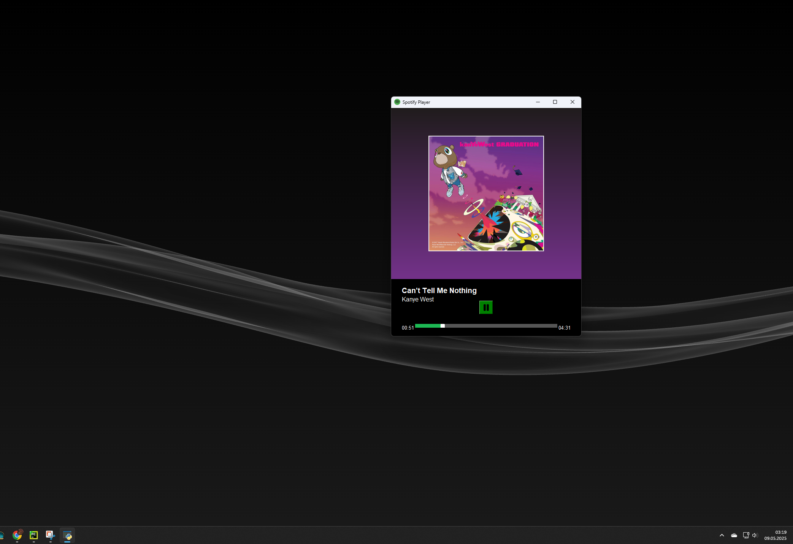

# 🎵 Spotify Player (Python + Tkinter)

&#x20;

Spotify Player to interaktywny odtwarzacz muzyki napisany w Pythonie z użyciem biblioteki `spotipy` (Spotify Web API) oraz `Tkinter` do graficznego interfejsu użytkownika. Umożliwia wyszukiwanie artysty, odtwarzanie losowego utworu, dynamiczne tło na podstawie okładki albumu oraz kontrolę odtwarzania i postępu utworu.

---

## ✨ Funkcje

* 🎧 Wyszukiwanie artysty i odtwarzanie losowego utworu z jego najpopularniejszych
* 🖼️ Dynamiczne gradientowe tło oparte na kolorach z okładki albumu
* 👟 Możliwość przewijania utworu kliknięciem lub przeciągnięciem wskaźnika

---

## 💪 Wymagania

* Python 3.7+
* Konto Spotify (premium wymagane do odtwarzania)
* Aplikacja Spotify zarejestrowana na [Spotify Developer Dashboard](https://developer.spotify.com/dashboard)

---

### Biblioteki Pythona

Zainstaluj zależności:

```bash
pip install spotipy pillow numpy requests
```

---

## ⚙️ Konfiguracja

Utwórz plik `secrets.json` w katalogu projektu z Twoimi danymi logowania Spotify:

```json
{
  "CLIENT_ID": "your client id",
  "CLIENT_SECRET": "your client secret",
  "REDIRECT_URI": "http://localhost:8888/callback"
}
```

Pamiętaj, aby `REDIRECT_URI` odpowiadało temu zarejestrowanemu na [dashboardzie Spotify](https://developer.spotify.com/dashboard).

---

## 🚀 Uruchomienie

```bash
python main.py
```

Następnie wpisz nazwę artysty, którego chcesz posłuchać.

---

## 📸 Screenshots





